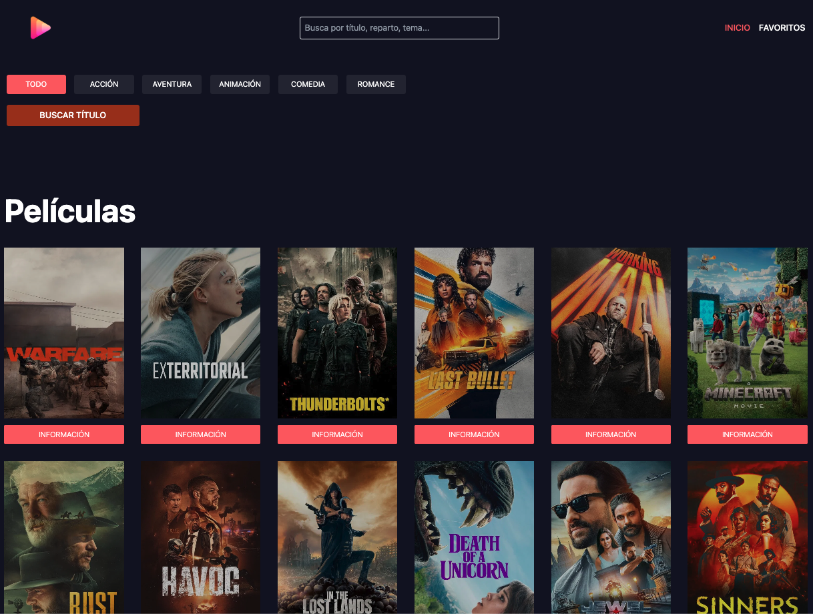
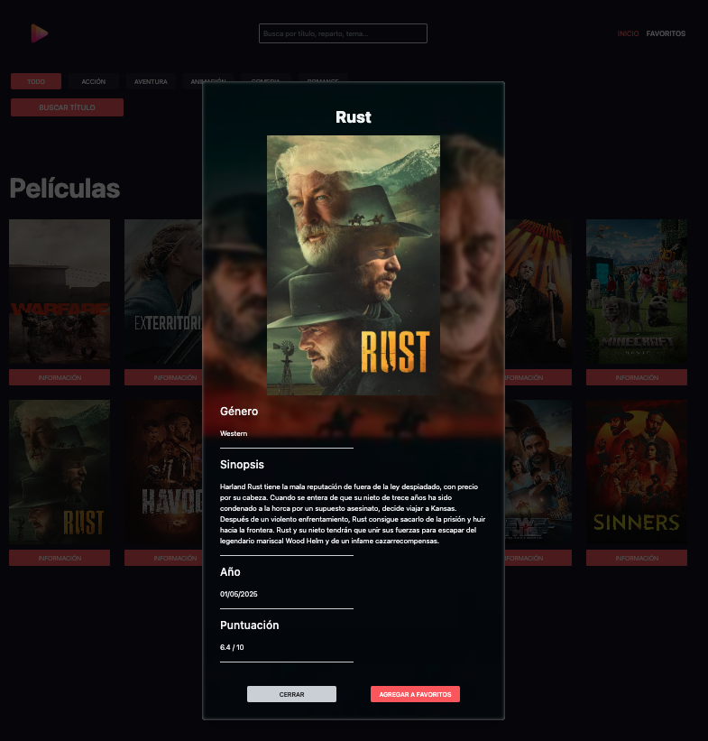

# MovieSearch — Buscador de Películas con React + Zustand + Zod


---

## 📄 Descripción

**MovieSearch** es una aplicación web desarrollada con **React + TypeScript** que permite buscar películas a través de una API pública. Implementa una arquitectura modular basada en componentes funcionales, middleware para controlar solicitudes, validaciones robustas con **Zod** y un estado global manejado con **Zustand**. Ofrece una interfaz moderna, eficiente y totalmente responsive.

---

## 🌐 Demo

🔗 [movie-db-api](https://movie-db-api-react.netlify.app/)


---

## 🖼️ Capturas

#### Vista principal


#### Modal de información



---

## ✨ Funcionalidades

- Búsqueda por título y categoría con filtros dinámicos
- Renderizado de resultados en tarjetas de película
- Modal detallado con información enriquecida del film
- Gestión de favoritos persistente
- Notificaciones contextuales tipo toast
- Validación de datos con **Zod**
- Enrutamiento dinámico con **React Router**
- Diseño moderno responsive con **Tailwind CSS**

---

## 💻 Tecnologías Utilizadas

- **React 18**
- **TypeScript**
- **Zustand** (gestión global del estado)
- **Zod** (validación de esquemas)
- **React Router**
- **Headless UI** (modal y transiciones)
- **Tailwind CSS**
- **Vite**

---

## 📋 Requisitos

- Node.js v18 o superior
- Conexión a internet (API externa)
- Git

---

## 🧱 Estructura del Proyecto

```bash
MovieSearch/
├── src/
│   ├── Components/            # Header, MovieCard, Modal, Notification
│   ├── layouts/               # Layout base
│   ├── views/                 # Páginas: Home, Favoritos
│   ├── stores/                # Zustand slices y estado global
│   ├── services/              # MovieService: lógica de consumo API
│   ├── utils/                 # Formateo y validación (Zod)
│   ├── types/                 # Tipos TypeScript
│   ├── router.tsx            # Enrutamiento principal
│   └── main.tsx              # Punto de entrada
├── tailwind.config.js
├── vite.config.ts

```

---


## 🛠️ Instalación

```bash
git clone https://github.com/eze-ms/Movie-DB-API-React
```

### Instalar dependencias 
```bash
npm install
```

### Iniciar servidor
```bash
npm run dev
```
---

© 2024. Proyecto desarrollado por Ezequiel Macchi Seoane